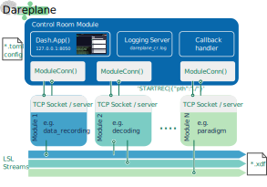

# Dareplane Example Setup

This repository guides you through an example setup for the Dareplane platform.

You will learn:

- How to build a simple paradigm presenting a visual cue and recording keyboard press reactions
- Wrapping this paradigm code into a Dareplane module
- Integrating the module into a full Dareplane setup using the [Dareplane control room (`dp-control-room`)](https://github.com/bsdlab/dp-control-room)

---

## Part 1: Environment Setup

Start by cloning this repository.

```bash
git clone git@github.com:bsdlab/tech_lecture_dp_example.git
cd tech_lecture_dp_example
```

Next, create a python environment and install the required dependencies. You can use `conda`, `venv`, `uv` or any other way for managing virtual python environments.

#### Option A: Using uv 
```bash
uv venv .venv --python 3.13
source .venv/bin/activate  # On Windows: .venv\Scripts\activate
uv sync
```

#### Option B: Using conda
```bash
conda create -n dareplane_example python=3.13
conda activate dareplane_example 
pip install -e .
```

#### Option C: Using venv
```bash
python -m venv .venv
source .venv/bin/activate  # On Windows: .venv\Scripts\activate
pip install -e .
```

### Verify Installation

```bash
python -c "from dareplane_utils.default_server.server import DefaultServer; print('✓ dareplane-utils installed')"
python -c "import pyglet; print('✓ pyglet installed')"
python -c "import pylsl; print('✓ pylsl installed')"
```

---

## Part 2: Understanding Dareplane Architecture

Dareplane follows a modular architecture where each component runs as an independent **module** that communicates via TCP sockets using **Primary Commands (PCOMMs)**.

```
┌─────────────────────────────────────────────────────────────────┐
│                      dp-control-room                            │
│                    (Web UI + Orchestration)                     │
└─────────────────┬───────────────┬───────────────┬───────────────┘
                ▲ │ TCP         ▲ │ TCP         ▲ │ TCP 
                │ ▼             │ ▼             │ ▼    
         ┌─────────────┐   ┌────────────┐   ┌────────────┐ 
         │dp-myparadigm│   │dp-mockup-  │   │dp-lsl-     │ 
         │ (Port 8084) │   │ streamer   │   │ recording  │
         │             │   │ (Port 8083)│   │ (Port 8082)│
         └─────┬───────┘   └─────┬──────┘   └─────┬──────┘
               │                 │                │
               ▼                 ▼                ▼
            [LSL Marker]    [LSL EEG]      [Records all
             Stream          Stream         LSL streams]
```



### Key Concepts

| Concept | Description |
|---------|-------------|
| **Module** | Independent process with a TCP server responding to commands |
| **PCOMM** | Primary Command - text-based command sent via TCP (e.g., `RUN`, `STOP`) |
| **LSL** | Lab Streaming Layer - protocol for streaming time-series data |
| **Control Room** | Central orchestration module providing a web UI |


---

## Part 3: Building the Paradigm Core Logic

We'll create a simple reaction time paradigm that:
1. Shows a fixation cross
2. After a random delay (1-3s), displays a green cue
3. Records the participant's key press reaction time
4. Sends markers to an LSL stream and logs it to standard Python logger

### 3.1 Examine the Paradigm Structure

The paradigm code is already provided in `mock_setup/dp-myparadigm/`. Let's understand its structure:

```
mock_setup/dp-myparadigm/
├── pyproject.toml          # Module dependencies
├── README.md               # Module documentation
├── myparadigm/
│   └── paradigm.py         # Core paradigm logic
└── api/
    └── server.py           # Dareplane server wrapper
```

### 3.2 Understanding the Core Paradigm

__Note__: The paradigm uses `pyglet` for visual presentation and `pylsl` for sending markers. This is not a tutorial on `pyglet` or `pylsl`, but we you will understand the basic usage by examining the code (~200 lines).

Open `mock_setup/dp-myparadigm/myparadigm/paradigm.py` and examine the key components:

```python
# The paradigm uses a state machine with these states:
# "instruction" -> starting trials:
#   "fixation" -> "cue" -> "response" -> (next trial)
```

**Key methods to understand:**

| Method | Purpose |
|--------|---------|
| `_setup_lsl()` | Creates an LSL marker stream outlet |
| `_send_marker()` | Sends timestamped markers (e.g., `"cue_onset,trial=0"`) |
| `_start_trial()` | Begins a trial with fixation cross |
| `_show_cue()` | Displays the green cue and records onset time |
| `_on_key_press()` | Handles participant response, calculates RT |
| `run()` | Main entry point to start the paradigm |

### 3.3 Test the Paradigm Standalone

Before integrating with Dareplane, test the paradigm directly:

```bash
cd mock_setup/dp-myparadigm
python -m myparadigm.paradigm
```

A window should appear. Wait for the green circle, then press `SPACE`. Press `ESC` to quit early.

> **Checkpoint ✓** You should see a pyglet window cycling through fixation → cue → feedback.

---

## Part 4: Wrapping as a Dareplane Module

Now we'll wrap the paradigm in a Dareplane-compatible server.

### 4.1 Understanding the Server Wrapper

Open `mock_setup/dp-myparadigm/api/server.py`:

```python
from dareplane_utils.default_server.server import DefaultServer
from fire import Fire

from myparadigm.paradigm import Paradigm
from myparadigm.utils.logging import logger


def run_server(
    ip: str = "localhost", port: int = 8084, log_level: str = "INFO"
) -> None:
    logger.setLevel(log_level.upper())

    # Create the paradigm instance
    paradigm = Paradigm(**kwargs)

    # Define the primary commands (PCOMMs) that this module responds to
    pcomm_map = {
        "RUN": paradigm.run,
    }

    # Create and start the Dareplane server
    server = DefaultServer(
        port=port,
        pcommand_map=pcomm_map,
        name="dp-myparadigm",
    )

    # Run the server (blocking)
    server.init_server()
    server.start_listening()
```

### 4.2 Test the Server Locally

Start the module server:

```bash
cd mock_setup/dp-myparadigm
python -m api.server --port=8080
```

##### Testing with telnet
In a **new terminal**, connect via telnet to test commands:

```bash
telnet 127.0.0.1 8084
```

Try these commands:
```
GET_PCOMMS
RUN|{"n_trials": 3}
```

##### Testing with Python auxiliary client:

```bash
python -m scripts.telpy 127.0.0.1 8080
```

> **Checkpoint ✓** The server should respond with available commands, and `RUN` should start the paradigm window.

**🎉 Congratulations!** You've just created your first standalone Dareplane module! 

This demonstrates a core philosophy of Dareplane: **minimal requirements, maximum freedom**. You implemented the paradigm's core functionality (visual cues, keyboard input, LSL streaming) in whatever way you chose—in this case, using pyglet. Dareplane only requires that you wrap this functionality with a TCP server that responds to primary commands (PCOMMs). This design keeps modules lightweight, language-agnostic, and easy to integrate into larger experimental setups.

---

## Part 5: Creating a Full Dareplane setup

### 5.1 Download Supporting Modules

Run the setup script to clone the required Dareplane modules:

```bash
cd /path/to/tech_lecture_dp_example
python scripts/mock_setup_script.py
```

This creates:

| Module | Purpose |
|--------|---------|
| `dp-control-room` | Web-based orchestration UI |
| `dp-mockup-streamer` | Simulates EEG data stream via LSL |
| `dp-lsl-recording` | Records all LSL streams to disk |
| `dp-myparadigm` | Your paradigm module (already exists) |

> **Note**: A Dareplane setup is simply a set of modules as folders on your hard drive, making it easy to customize, extend and manage.

### 5.3 Understand the Control Room Configuration

The setup script generated a config at `mock_setup/dp-control-room/configs/myparadigm_full_setup.toml`.

Key sections:

```toml
[python.modules.dp-myparadigm]
    type = 'paradigm'
    port = 8084
    ip = '127.0.0.1'

[macros.run_paradigm]
    name = 'RUN PARADIGM'
    description = 'Start the visual cue paradigm with recording'
[macros.run_paradigm.cmds]
    com1 = ['dp-lsl-recording', 'UPDATE']
    com2 = ['dp-lsl-recording', 'SELECT_ALL']
    com3 = ['dp-lsl-recording', 'SET_SAVE_PATH', ...]
    com4 = ['dp-lsl-recording', 'RECORD']
    com5 = ['dp-myparadigm', 'RUN', 'n_trials=n_trials']
```

**Macros** chain multiple PCOMMs together - clicking "RUN PARADIGM" will:
1. Update available LSL streams
2. Select all streams for recording
3. Set the save path
4. Start recording
5. Start your paradigm

---

## Part 6: Running the Full Setup

1. Ensure that the [`labrecorder`](https://github.com/labstreaminglayer/App-LabRecorder) is running. Currently, the `dp-lsl-recording` only controls the functionality of the `labrecorder`. Spawning it automatically will be implemented in the next version.

2. Execute the `run` script in the `dp-control-room`:

```bash
cd mock_setup/dp-control-room
./run_mockup_experiment.sh
```

Potentially, you need to make the script executable first:

```bash
chmod +x run_mockup_experiment.sh
```

Or start using python as the `run_mockup_experiment.sh` is just a convenience wrapper for:
```bash
python -m control_room.main --setup_cfg_path="<path-to-your>/dp-control-room/configs/myparadigm_full_setup.toml"
```


### Using the Control Room

1. Open your browser to `http://127.0.0.1:8050`
2. You should see all modules connected (green status)
3. Click **"RUN PARADIGM"** macro to:
   - Start LSL recording
   - Launch the paradigm window
4. Complete the trials
5. Stop the recording by clicking the "STOP RECORDING" macro in the control room (if not set to auto-stop after paradigm ends)
6. Stop the control room and associated modules by interrupting the terminal (Ctrl+C).

### Verify Recording

Check the `mock_setup/data/` folder for recorded XDF files:

```bash
ls mock_setup/data/
```

You can visualize the data using the example script: 
```bash
python -m scripts.show_xdf_content ./mock_setup/data/<your_recording_file>.xdf
```


---

## A Real Example

A full example of a real cVEP (code-modulated Visual Evoked Potential) speller setup can be found [here](https://github.com/thijor/dp-cvep/tree/main).

This demonstrates:
- Complex paradigm with visual stimulation
- Real-time signal processing
- Online classification and feedback
- Multi-module coordination

---

## Troubleshooting

| Issue | Solution |
|-------|----------|
| Module not connecting | Check port numbers match config |
| LSL stream not found | Ensure mockup streamer is running first |
| Pyglet window not appearing | Check display/GPU drivers |
| Permission denied on ports | Use ports > 1024 or run with elevated privileges |

## Resources

- [Dareplane Documentation](https://github.com/bsdlab/Dareplane)
- [dareplane-utils](https://github.com/bsdlab/dareplane-utils)
- [Lab Streaming Layer](https://labstreaminglayer.org/)
- [Pyglet Documentation](https://pyglet.readthedocs.io/)
